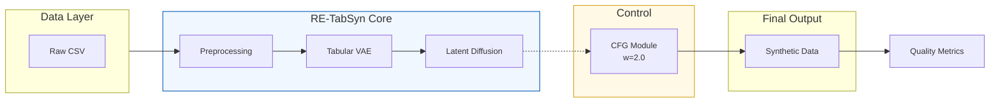
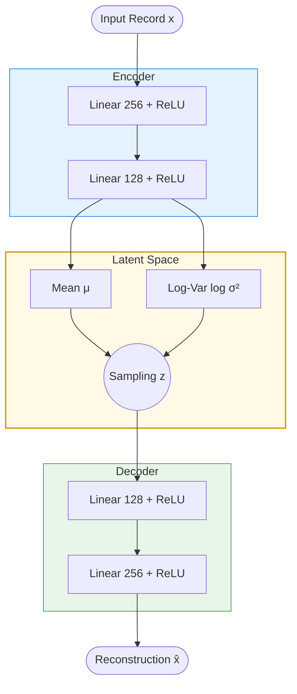
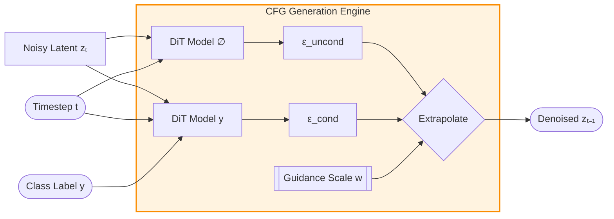
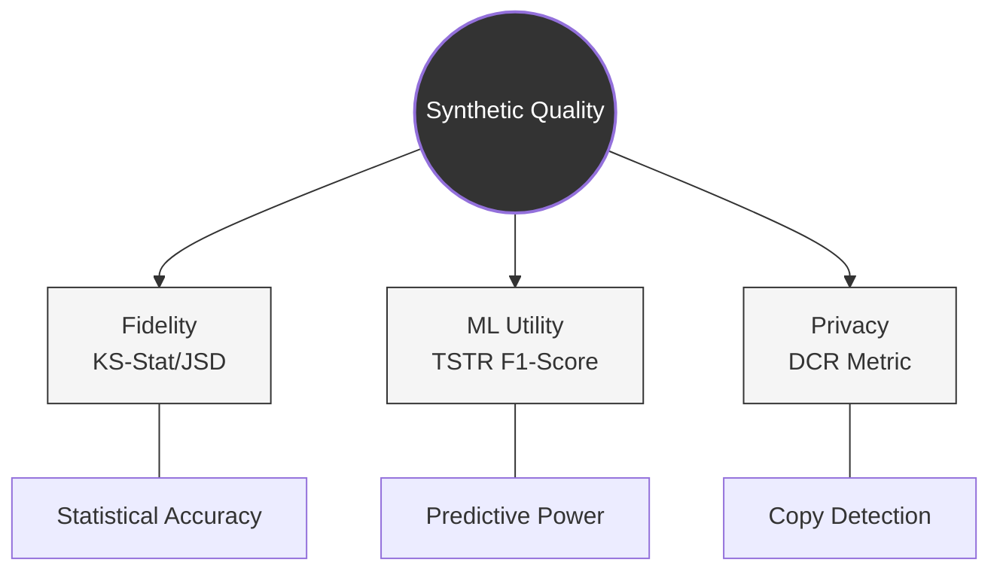
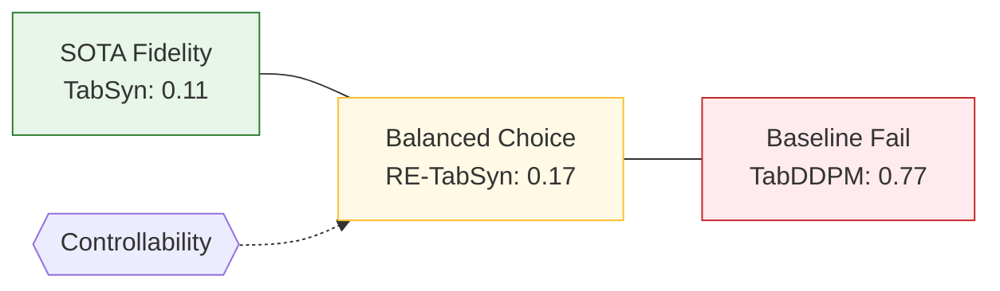

# Research Paper Diagram Codes (Mermaid - Aesthetic Version)

These refined diagrams use professional styling, consistent color coding, and compact layouts for conference paper readiness.

## 1. System Architecture (fig:system_arch)

## 2. VAE Architecture (fig:vae_arch)

## 3. CFG Mechanism (fig:cfg)

## 4. Evaluation Framework (fig:evaluation)

## 5. Trade-off Comparison (fig:tradeoff)

