# Research Paper Diagrams - Fixed Layout

*All diagrams optimized to prevent arrow overlapping*

---

## Diagram Standards Applied

- **Format:** Mermaid with simplified layouts
- **Layout:** Sequential flow to prevent overlaps
- **Direction:** Consistent TB (top-bottom) or LR (left-right)
- **Subgraphs:** Minimal nesting to avoid rendering issues

---

# 1. High-Level System Pipeline

## Diagram 1.1: RE-TabSyn End-to-End Pipeline

**Caption:** *Complete pipeline from data ingestion to synthetic data generation.*

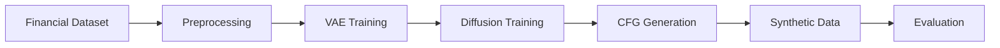

---

## Diagram 1.2: Detailed Pipeline (Vertical)

**Caption:** *Expanded view of the complete RE-TabSyn pipeline.*

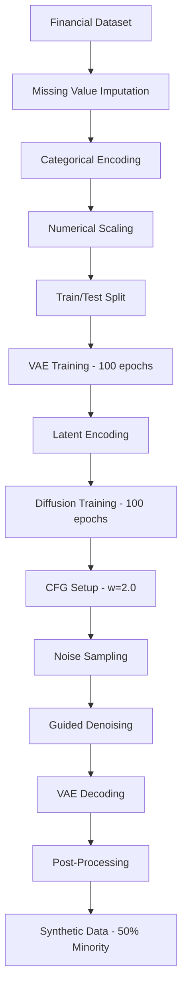

---

# 2. Model Architecture Diagrams

## Diagram 2.1: VAE Architecture

**Caption:** *Variational Autoencoder structure for tabular data.*

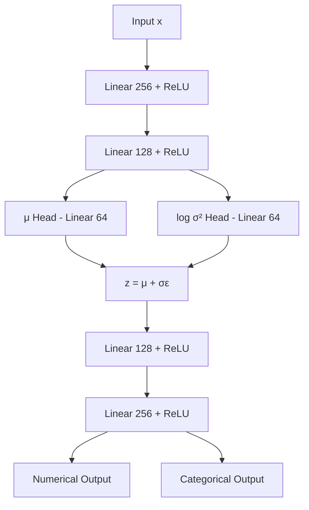

---

## Diagram 2.2: Latent Diffusion Process

**Caption:** *Forward noising and reverse denoising in latent space.*

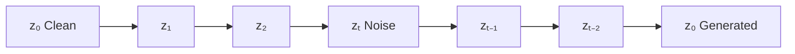

---

## Diagram 2.3: Diffusion Transformer Block

**Caption:** *Single DiT block with AdaLN conditioning.*

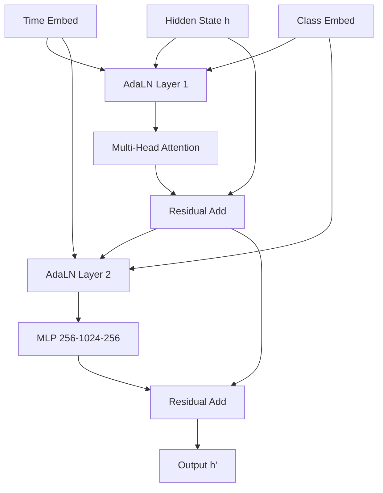

---

## Diagram 2.4: Classifier-Free Guidance

**Caption:** *CFG computation combining conditional and unconditional predictions.*

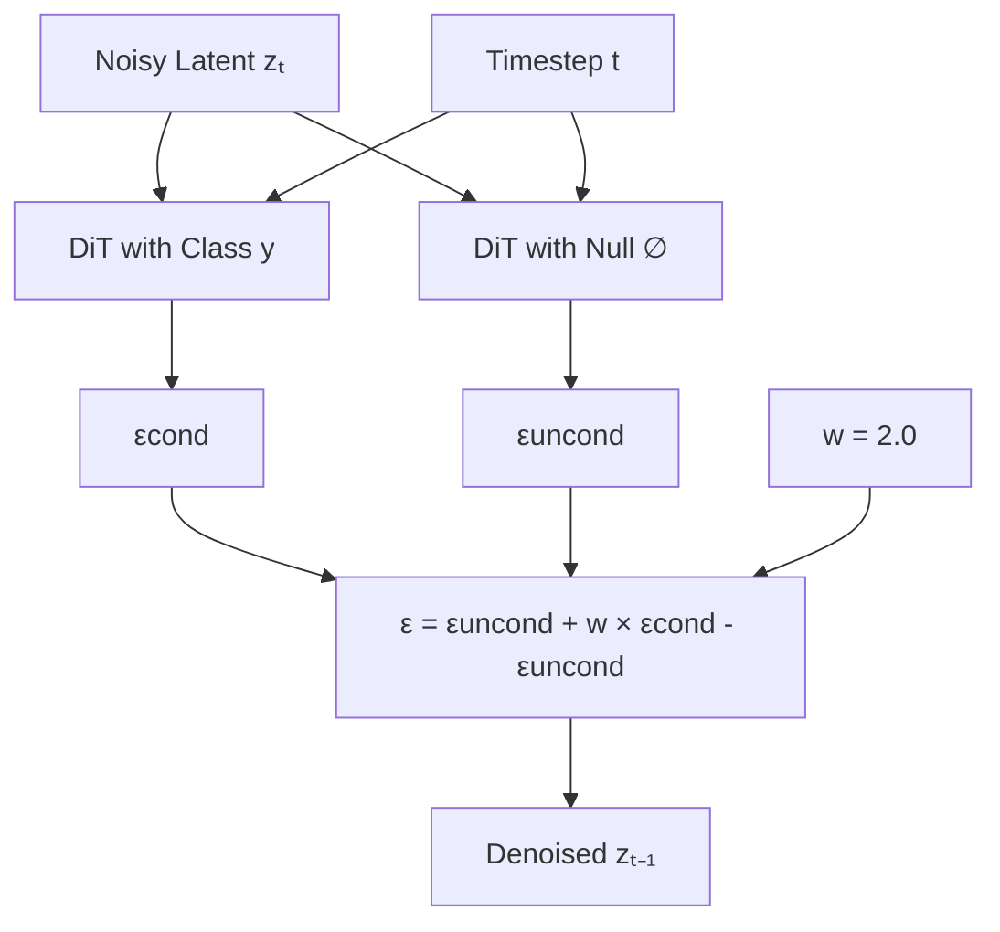

---

# 3. Training Pipeline Diagrams

## Diagram 3.1: Two-Phase Training

**Caption:** *Sequential VAE and Diffusion training phases.*

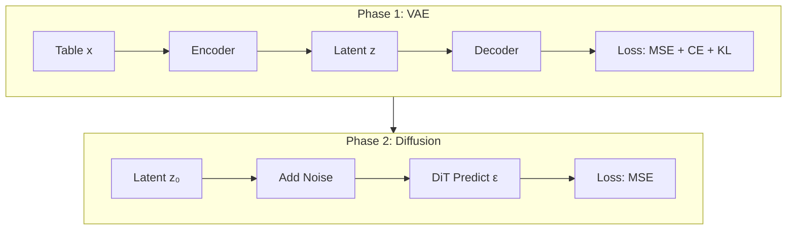

---

## Diagram 3.2: Label Dropout for CFG

**Caption:** *10% of labels replaced with null during training.*

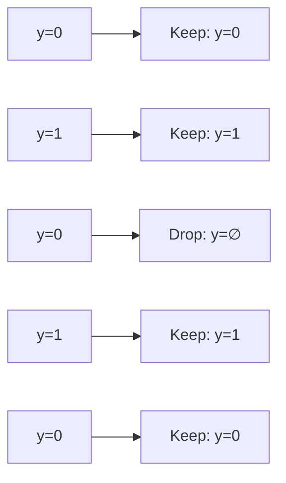

---

# 4. Generation Pipeline

## Diagram 4.1: Complete Generation Flow

**Caption:** *Full synthetic data generation from noise to table.*

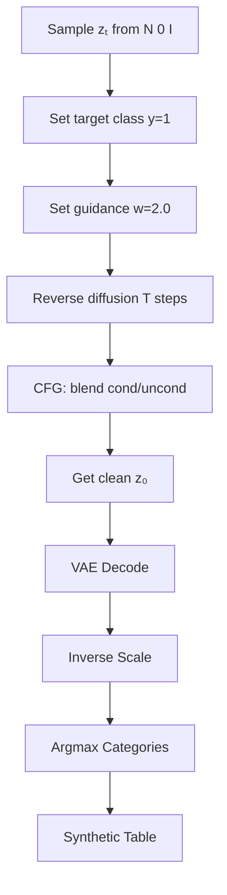

---

# 5. Evaluation Framework

## Diagram 5.1: Three-Pillar Evaluation

**Caption:** *Fidelity, Utility, and Privacy evaluation metrics.*

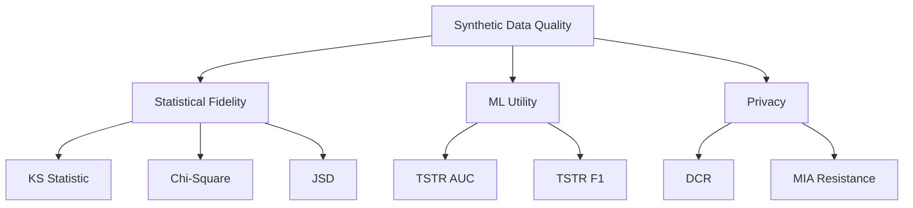

---

## Diagram 5.2: TSTR Evaluation Protocol

**Caption:** *Train on Synthetic, Test on Real workflow.*

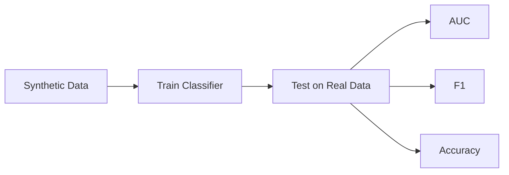

---

# 6. Data Preprocessing

## Diagram 6.1: Preprocessing Pipeline

**Caption:** *Data preparation workflow from raw to model-ready.*

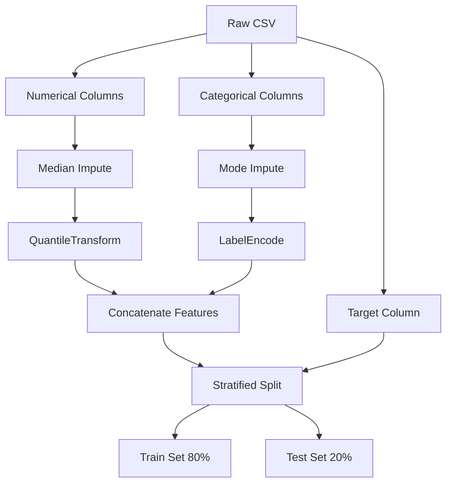

---

# 7. Model Comparison

## Diagram 7.1: Capability Matrix

**Caption:** *Comparison of model capabilities.*

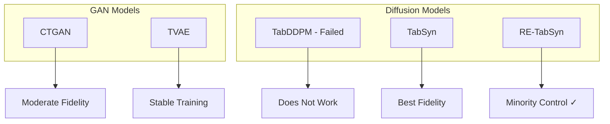

---

## Diagram 7.2: Trade-off Comparison

**Caption:** *Performance trade-off between models.*

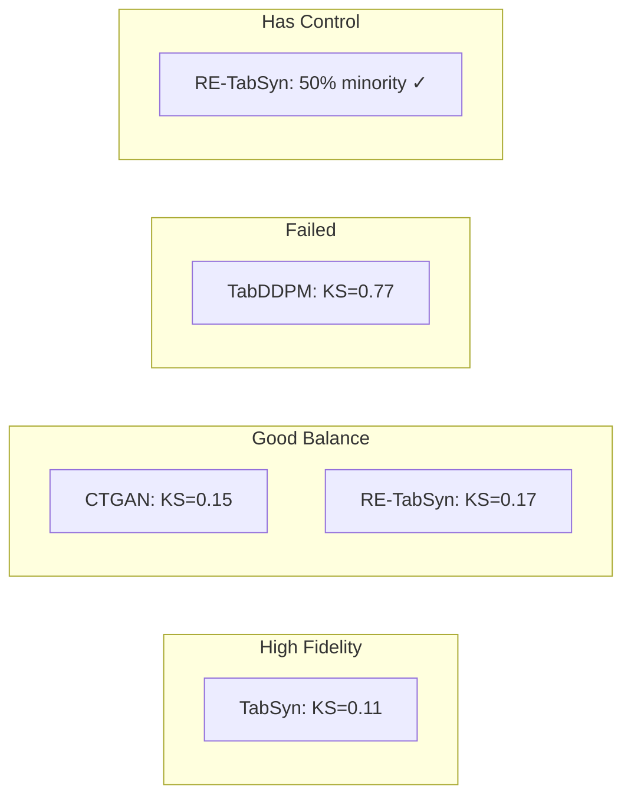

---

# 8. Research Methodology Flow

## Diagram 8.1: Research Process

**Caption:** *From problem identification to validation.*

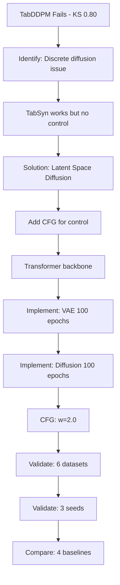

---

# 9. VAE Training Loop

## Diagram 9.1: VAE Forward Pass

**Caption:** *Single training iteration for VAE.*

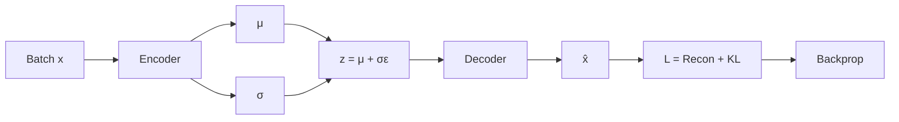

---

# 10. Diffusion Training Loop

## Diagram 10.1: Diffusion Forward Pass

**Caption:** *Single training iteration for diffusion.*

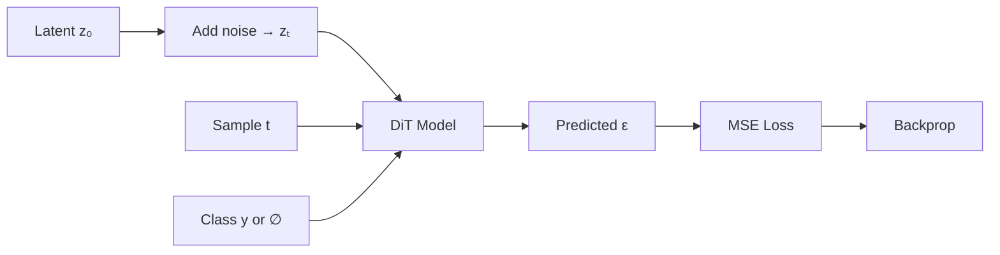

---

# 11. CFG Sampling Loop

## Diagram 11.1: Single Denoising Step

**Caption:** *One step of CFG-guided reverse diffusion.*

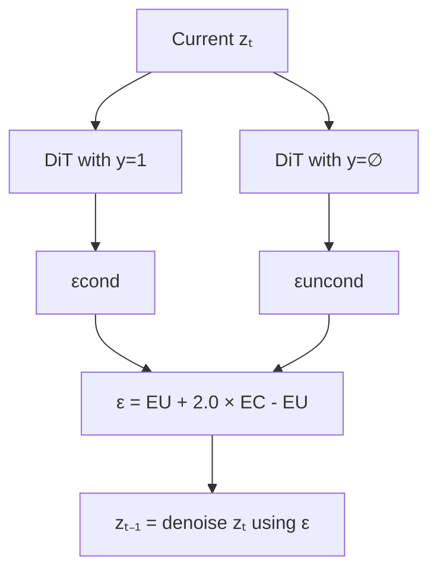

---

# 12. Complete System Architecture

## Diagram 12.1: System Block Diagram

**Caption:** *All components of RE-TabSyn system.*

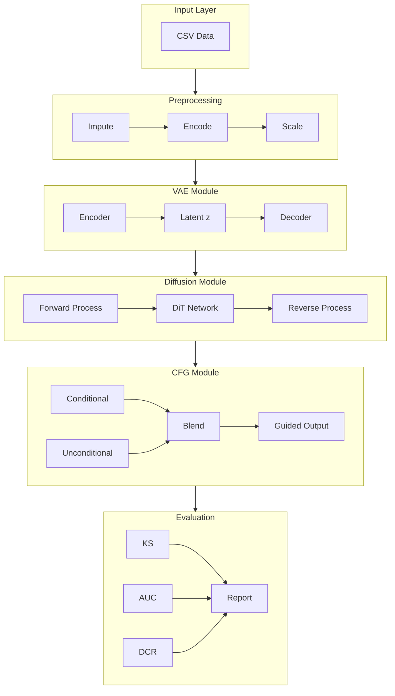

---

# 13. Minority Ratio Control

## Diagram 13.1: Guidance Scale Effect

**Caption:** *How guidance scale affects minority ratio.*

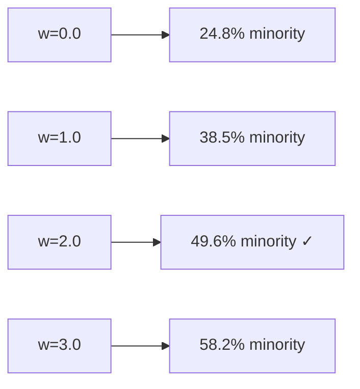

---

# 14. Privacy Evaluation

## Diagram 14.1: DCR Computation

**Caption:** *Distance to Closest Record calculation.*

```mermaid
flowchart TB
    SYN[Each synthetic record] --> DIST[Compute distance to all real records]
    DIST --> MIN[Find minimum distance]
    MIN --> DCR[DCR = min distance]
    DCR --> CHECK{DCR > 1.0?}
    CHECK --> |Yes| SAFE[Privacy OK ✓]
    CHECK --> |No| RISK[Privacy Risk ⚠]
```

---

# 15. TSTR vs TRTR Comparison

## Diagram 15.1: Utility Evaluation Types

**Caption:** *Different training/testing combinations.*

```mermaid
flowchart TB
    subgraph TRTR[TRTR - Baseline]
        T1[Train: Real] --> T2[Test: Real]
    end
    
    subgraph TSTR[TSTR - Primary]
        S1[Train: Synthetic] --> S2[Test: Real]
    end
    
    subgraph COMPARE[Compare]
        T2 --> C[Utility Ratio = TSTR/TRTR]
        S2 --> C
    end
```

---

# 16. Dataset Characteristics

## Diagram 16.1: Dataset Overview

**Caption:** *Benchmark datasets and their properties.*

```mermaid
flowchart TB
    subgraph EXTREME[Extreme Imbalance 5%]
        D1[Polish Bankruptcy: 4.8%]
    end
    
    subgraph SEVERE[Severe Imbalance 10-20%]
        D2[Bank Marketing: 11.3%]
        D3[Lending Club: 20.0%]
    end
    
    subgraph MODERATE[Moderate Imbalance 20-35%]
        D4[Adult Income: 24.8%]
        D5[German Credit: 30.0%]
    end
    
    subgraph BALANCED[Near Balanced 40%+]
        D6[Credit Approval: 44.5%]
    end
```

---

# 17. Results Summary

## Diagram 17.1: Model Rankings

**Caption:** *Final performance ranking of all models.*

```mermaid
flowchart LR
    subgraph RANK[Performance Ranking]
        R1[1. TabSyn - Best Fidelity]
        R2[2. RE-TabSyn - Best Control]
        R3[3. CTGAN - Moderate]
        R4[4. TVAE - Stable]
        R5[5. TabDDPM - Failed]
    end
    
    R1 --> R2 --> R3 --> R4 --> R5
```

---

# Diagram Index

| # | Name | Type | Section |
|:--|:-----|:-----|:--------|
| 1.1 | Pipeline Simple | flowchart LR | Overview |
| 1.2 | Pipeline Detailed | flowchart TB | Overview |
| 2.1 | VAE Architecture | flowchart TB | Methodology |
| 2.2 | Diffusion Process | flowchart LR | Methodology |
| 2.3 | DiT Block | flowchart TB | Methodology |
| 2.4 | CFG Mechanism | flowchart TB | Methodology |
| 3.1 | Two-Phase Training | flowchart TB | Implementation |
| 3.2 | Label Dropout | flowchart LR | Implementation |
| 4.1 | Generation Flow | flowchart TB | Implementation |
| 5.1 | Evaluation Framework | flowchart TB | Evaluation |
| 5.2 | TSTR Protocol | flowchart LR | Evaluation |
| 6.1 | Preprocessing | flowchart TB | Datasets |
| 7.1 | Capability Matrix | flowchart TB | Results |
| 7.2 | Trade-off | flowchart LR | Results |
| 8.1 | Research Process | flowchart TB | Methodology |
| 9.1 | VAE Loop | flowchart LR | Implementation |
| 10.1 | Diffusion Loop | flowchart LR | Implementation |
| 11.1 | CFG Step | flowchart TB | Implementation |
| 12.1 | System Architecture | flowchart TB | Overview |
| 13.1 | Guidance Effect | flowchart LR | Results |
| 14.1 | DCR Computation | flowchart TB | Evaluation |
| 15.1 | TSTR vs TRTR | flowchart TB | Evaluation |
| 16.1 | Dataset Overview | flowchart TB | Datasets |
| 17.1 | Model Rankings | flowchart LR | Results |

---

*All diagrams use simplified layouts to prevent arrow overlapping*
*Consistent use of flowchart TB or LR for predictable rendering*
*Minimal subgraph nesting to avoid layout conflicts*
